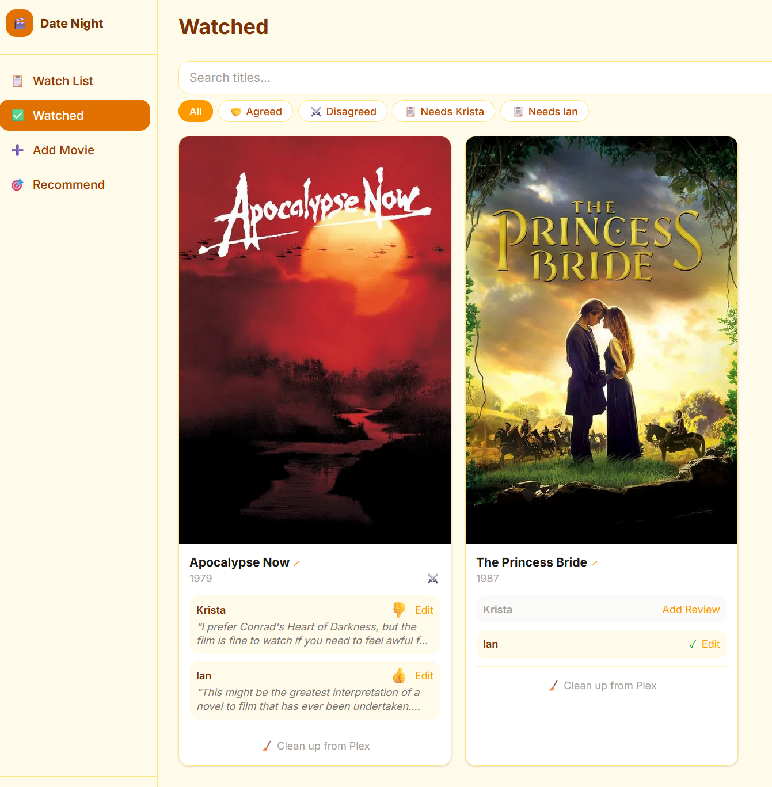
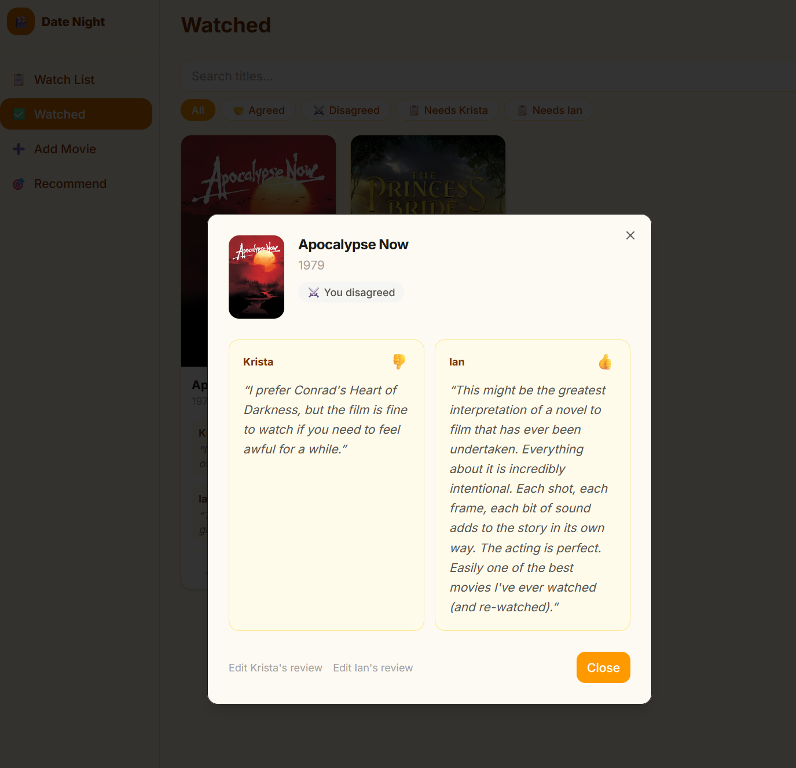

# Date Night

[](https://github.com/datenight-team/datenight/actions/workflows/ci.yml)
[](LICENSE)
[](https://nextjs.org/)
[](https://www.typescriptlang.org/)
[](Dockerfile)
[](https://anthropic.com)

A little app for a couple to use to manage their date night movie watching.

Date night movies have always been a thing here but managing watch lists has
been something we've done on a spreadsheet. We thought it'd be fun to modernize
the experience a bit. The interface is purposely simple. It's focused on making
it easy to add movies and manage what to watch. That's it.

The app lets anyone add movies to the watch list by simply pasting an IMDB or
Criterion link. Once it's on the list, you can manage the availability of the
film for watching. The app will automatically keep a collection in sync for you
as things arrive.

The fun starts _after_ you've watched a movie together. Marking a movie watched
gives you both an opportunity to rate the movie and leave a little review.
Ratings are thumps up/down, Siskel-and-Ebert style. The app won't show you the
other partner's rating on a movie until you've both entered your rating. No
influencing each other's opinions!

There's a recommendation interface as well. You give it a Claude API key and it
uses your watch history to recommend films based on things you've both agreed
on. It recommends to things it thinks you'll both agree on based on your
history and a third, wildcard recommendation to expand your horizons.

## Screenshots

<table>
  <tr>
    <td align="center"><a href="datenight-watch-list.png"></a><br/><sub>Watchlist</sub></td>
    <td align="center"><a href="datenight-add-movie.png"></a><br/><sub>Add Movie</sub></td>
    <td align="center"><a href="datenight-recommendations.png"></a><br/><sub>Recommendations</sub></td>
  </tr>
  <tr>
    <td align="center"><a href="datenight-watched.png"></a><br/><sub>Watched</sub></td>
    <td align="center"><a href="datenight-watched-detail.png"></a><br/><sub>Review Detail</sub></td>
    <td></td>
  </tr>
</table>

## Features

- **Add movies** by pasting an IMDB or Criterion Collection URL — metadata pulled from TMDB automatically. Simple and easy for anyone to understand and use.
- **Streaming availability** — each watchlist movie shows which of your subscribed services carry it, with direct links to watch; a **▶ Streamable** filter narrows the list to films you can watch tonight; a **Refresh Streaming** button in the sidebar re-syncs availability on demand (no waiting for the 12-hour cron)
- **Plex integration** — a "Date Night" collection is kept in sync with available movies in watch order; a **Sync Plex** button in the sidebar triggers an on-demand update
- **Seerr integration** — for managing movie availability and handling clean up post-watch
- **Blind ratings** — each person gives a thumbs up or down and writes a critic's quote independently (Siskel & Ebert style); results are revealed only after both have rated, with 🤝 if you agreed and ⚔️ if you didn't
- **Recommendations** — Claude Opus analyzes your agreed-upon films and recommends 2 consensus picks (films you'll both likely 👍) and 1 wild card (a deliberate push outside your comfort zone); optional Criterion-only filter
- **Ask Claude** — sidebar link opens Claude with a pre-filled prompt based on recently watched films

## Configuration

App configuration is largely kept in the SQLite database. The only env var you need to get the app working is the path to the SQLite database.

The first time you run the app, there's a config procedure that will walk you through the setup.

| Variable | Description |
|---|---|
| `DATABASE_URL` | SQLite path — `file:./data/datenight.db` locally, `file:/app/data/datenight.db` in Docker |

## Running Locally

```bash
make setup   # first time: installs deps, creates .env.local, migrates DB
```

Edit `.env.local` with your API keys, then:

```bash
make dev     # http://localhost:3000
```

## Running in Docker

```bash
make docker-build   # build the image
make docker-up      # start via docker compose (detached)
make docker-logs    # tail logs
make docker-down    # stop
```

The container runs `prisma migrate deploy` on startup before serving traffic.

## Bulk Import from a Spreadsheet

If you have an existing list of films in a Google Sheet (or any spreadsheet), export it as CSV (File → Download → CSV) then:

```bash
# Local dev
make import file=~/Downloads/criterion.csv

# Production (Docker)
make docker-import file=~/Downloads/criterion.csv
```

If the title column isn't auto-detected, pass its name as a second argument to the underlying script: `npm run import -- ~/Downloads/criterion.csv "Film Title"`.

Auto-detected column names: `Title`, `Film`, `Movie`, `Name`, `Film Title`, `Movie Title`.

The script looks up each film on TMDB by title, skips anything already in the list, and prints a summary of what imported, what was skipped, and anything it couldn't find (so you can add those manually via the UI).

## Tests & Checks

```bash
make test-run   # run all tests once
make test       # watch mode
make check      # tests + lint + typecheck together
```

## All Make Targets

```bash
make help       # full list of available commands
```

## Troubleshooting

**Watchlist movies all show "Checking…" for streaming availability**
Streaming data hasn't synced yet. It runs automatically on movie add and every 12 hours thereafter, but a fresh install or a newly added subscription won't have data until the first sync completes. Click **📡 Refresh Streaming** in the sidebar to trigger an immediate re-sync. Configure which services to track in Settings → Streaming.

**Movies show "Not Requested" and never download**
Seerr integration is failing silently. Check that the Seerr URL and Seerr API key are correct in the Configuration section of the application and that the container can reach Seerr. The sync job runs every 5 minutes — check logs: `make docker-logs`.

**Plex collection isn't updating**
Check the Plex URL and the Plex token. The Plex token expires occasionally; get a fresh one from Settings → Troubleshooting → Get Token in the Plex UI. The collection syncs as part of the same 5-minute cron job as Seerr, or use the **🎭 Sync Plex** button in the sidebar for an immediate update.

**Add Movie shows an error for a valid URL**
The Movie Database API key is likely missing or wrong. Test it: `curl "https://api.themoviedb.org/3/movie/550?api_key=YOUR_KEY"` — should return JSON, not an auth error.

**The app starts but the database is empty after a restart**
The data volume isn't persisted. With the named volume (`datenight-data`) in `docker-compose.yml`, data survives restarts automatically. If you switched from a bind mount, the old data is still at the bind mount path.

**Inspecting or editing the database directly**
```bash
make db-studio        # local dev — browser GUI at localhost:5555
make docker-shell     # production — shell inside the running container
                      # database is at /app/data/datenight.db
```

**Recommendations page shows an error or returns nothing useful**
Make sure the Anthropoic API key is set and valid. Note, you cannot use a long lived OAuth key on your plan for this. Anthropic will insist you use an API key that's attached to pay-as-go credits. The feature works best after you've rated a few films together — the more you've agreed on, the sharper the recommendations.

**Container won't start / exits immediately**
Run `make docker-logs`. The most common cause is a missing environment variable or a database migration failure on first boot.

## License

MIT — see [LICENSE](LICENSE).
