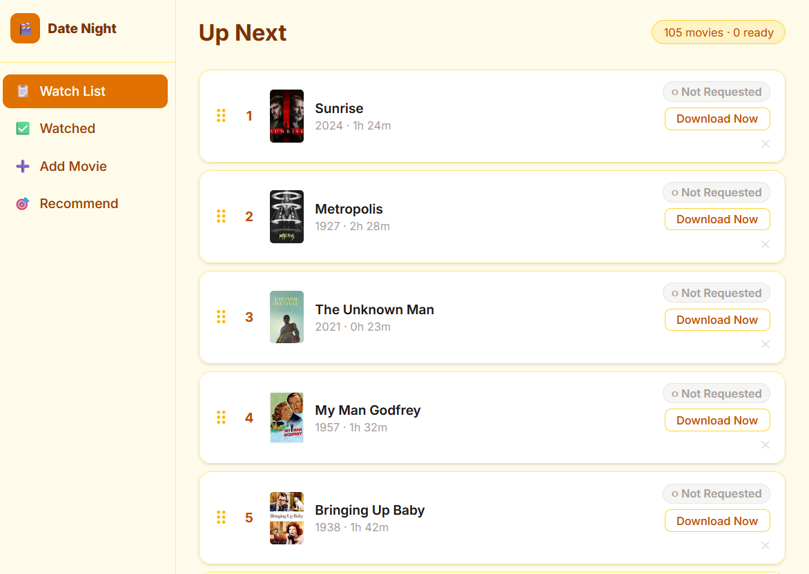
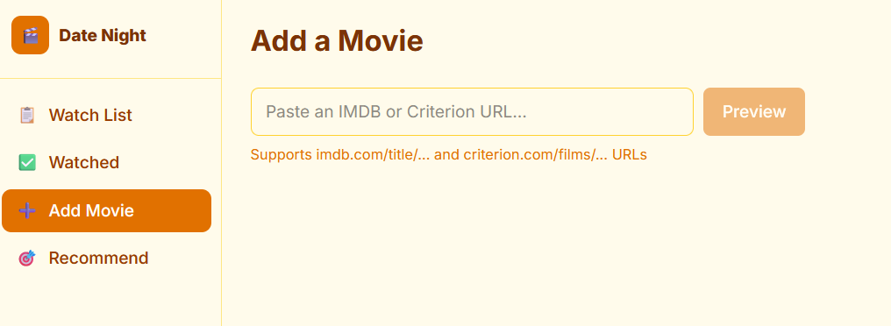
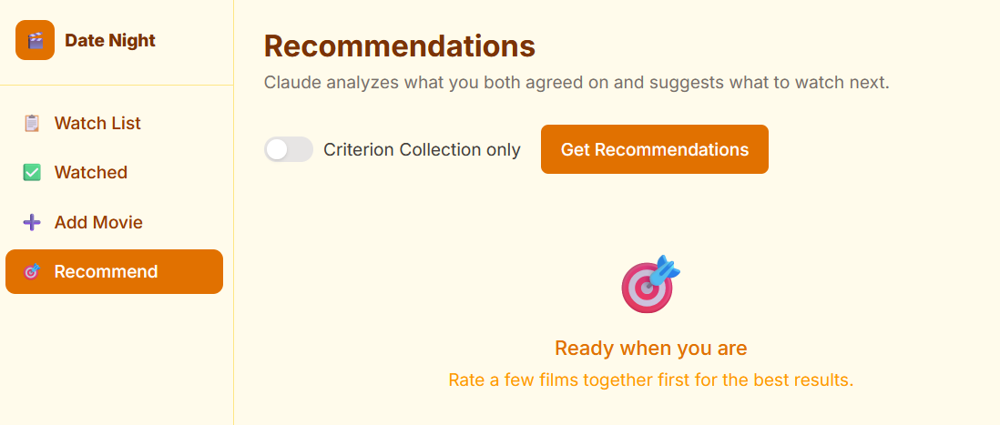

# Date Night

[](https://github.com/ianchesal/datenight/actions/workflows/ci.yml)
[](LICENSE)
[](https://nextjs.org/)
[](https://www.typescriptlang.org/)
[](Dockerfile)
[](https://anthropic.com)

A home-lab web app for two people to manage their [Criterion Collection](https://www.criterion.com) date night movie watchlist.

Runs in Docker alongside their *arr stack. Add movies by pasting an IMDB or Criterion URL, drag to set the watch order, and the app automatically queues downloads via Seerr and keeps a "Date Night" Plex playlist in sync.

## Screenshots

<table>
  <tr>
    <td align="center"><a href="datenight-watch-list.png"></a><br/><sub>Watchlist</sub></td>
    <td align="center"><a href="datenight-add-movie.png"></a><br/><sub>Add Movie</sub></td>
    <td align="center"><a href="datenight-recommendations.png"></a><br/><sub>Recommendations</sub></td>
  </tr>
</table>

## Features

- **Add movies** by pasting an IMDB or Criterion Collection URL — metadata pulled from TMDB automatically
- **Drag to reorder** the watchlist (dnd-kit sortable)
- **Seerr integration** — top 10 unwatched movies are automatically requested for download; status shown per movie (Queued / Downloading / Ready)
- **Plex integration** — a "Date Night" playlist is kept in sync with available movies in watch order
- **Blind ratings** — each person gives a thumbs up or down and writes a critic's quote independently (Siskel & Ebert style); results are revealed only after both have rated, with 🤝 if you agreed and ⚔️ if you didn't
- **Recommendations** — Claude Opus analyzes your agreed-upon films and recommends 2 consensus picks (films you'll both likely 👍) and 1 wild card (a deliberate push outside your comfort zone); optional Criterion-only filter
- **Ask Claude** — sidebar link opens Claude with a pre-filled prompt based on recently watched films
- **Warm amber theme** — cozy UI, not a media server dashboard

## Stack

| Layer | Technology |
|---|---|
| Framework | Next.js 14 (App Router) |
| Language | TypeScript |
| Styling | Tailwind CSS + shadcn/ui |
| Drag & drop | dnd-kit |
| Database | SQLite via Prisma ORM |
| Background jobs | node-cron (inside the Next.js server process) |
| Runtime | tsx (TypeScript execution) |
| Tests | Vitest + Testing Library |
| Container | Docker (single Alpine image) |

## Configuration

All secrets are passed as environment variables. `make setup` creates `.env.local` from `.env.example` automatically. Edit it to fill in your API keys before starting the app.

| Variable | Description |
|---|---|
| `DATABASE_URL` | SQLite path — `file:./data/datenight.db` locally, `file:/app/data/datenight.db` in Docker |
| `TMDB_API_KEY` | [TMDB API v3 key](https://developer.themoviedb.org/docs/getting-started) (free) |
| `SEERR_URL` | Base URL of your Seerr instance, e.g. `http://seerr:5055` |
| `SEERR_API_KEY` | Seerr API key (Settings → API Key) |
| `PLEX_URL` | Base URL of your Plex server, e.g. `http://plex:32400` |
| `PLEX_TOKEN` | [Plex authentication token](https://support.plex.tv/articles/204059436-finding-an-authentication-token-x-plex-token/) |
| `USER1_NAME` | Display name for the first user (default: `User 1`) |
| `USER2_NAME` | Display name for the second user (default: `User 2`) |
| `ANTHROPIC_API_KEY` | [Anthropic API key](https://console.anthropic.com/) — required for the Recommendations feature; the rest of the app works without it |

## Running Locally

```bash
make setup   # first time: installs deps, creates .env.local, migrates DB
```

Edit `.env.local` with your API keys, then:

```bash
make dev     # http://localhost:3000
```

## Running in Docker

```bash
make docker-build   # build the image
make docker-up      # start via docker compose (detached)
make docker-logs    # tail logs
make docker-down    # stop
```

The container runs `prisma migrate deploy` on startup before serving traffic.

## Bulk Import from a Spreadsheet

If you have an existing list of films in a Google Sheet (or any spreadsheet), export it as CSV (File → Download → CSV) then:

```bash
# Local dev
make import file=~/Downloads/criterion.csv

# Production (Docker)
make docker-import file=~/Downloads/criterion.csv
```

If the title column isn't auto-detected, pass its name as a second argument to the underlying script: `npm run import -- ~/Downloads/criterion.csv "Film Title"`.

Auto-detected column names: `Title`, `Film`, `Movie`, `Name`, `Film Title`, `Movie Title`.

The script looks up each film on TMDB by title, skips anything already in the list, and prints a summary of what imported, what was skipped, and anything it couldn't find (so you can add those manually via the UI).

## Tests & Checks

```bash
make test-run   # run all tests once
make test       # watch mode
make check      # tests + lint + typecheck together
```

## All Make Targets

```bash
make help       # full list of available commands
```

## Project Structure

```
src/
  app/
    api/              # Next.js API routes
    watchlist/        # Draggable watch list page
    watched/          # Grid of watched + reviewed movies
    add/              # URL paste → preview → add flow
    recommendations/  # Claude-powered film recommendations
  components/         # Shared UI components
  lib/                # Server-side clients (TMDB, Seerr, Plex, Claude, sync)
  types/              # Shared TypeScript interfaces
prisma/
  schema.prisma       # Movie, Rating, Setting models
  migrations/         # SQLite migrations
scripts/
  import-csv.ts       # Bulk import from CSV / Google Sheets export
tests/                # Vitest test files
server.ts             # Custom Next.js server (starts sync job in production)
```

## Troubleshooting

**Movies show "Not Requested" and never download**
Seerr integration is failing silently. Check that `SEERR_URL` and `SEERR_API_KEY` are correct and that the container can reach Seerr. The sync job runs every 5 minutes — check logs: `make docker-logs`.

**Plex playlist isn't updating**
Check `PLEX_URL` and `PLEX_TOKEN`. The Plex token expires occasionally; get a fresh one from Settings → Troubleshooting → Get Token in the Plex UI. The playlist syncs as part of the same 5-minute cron job as Seerr.

**Add Movie shows an error for a valid URL**
The `TMDB_API_KEY` is likely missing or wrong. Test it: `curl "https://api.themoviedb.org/3/movie/550?api_key=YOUR_KEY"` — should return JSON, not an auth error.

**The app starts but the database is empty after a restart**
The data volume isn't persisted. With the named volume (`datenight-data`) in `docker-compose.yml`, data survives restarts automatically. If you switched from a bind mount, the old data is still at the bind mount path.

**Inspecting or editing the database directly**
```bash
make db-studio        # local dev — browser GUI at localhost:5555
make docker-shell     # production — shell inside the running container
                      # database is at /app/data/datenight.db
```

**Recommendations page shows an error or returns nothing useful**
Make sure `ANTHROPIC_API_KEY` is set and valid. The feature works best after you've rated a few films together — the more you've agreed on, the sharper the recommendations.

**Container won't start / exits immediately**
Run `make docker-logs`. The most common cause is a missing environment variable or a database migration failure on first boot.

## License

MIT — see [LICENSE](LICENSE).
